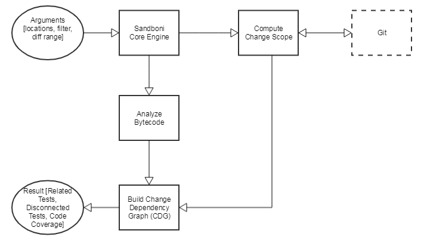

# 

<h1 align="center">Sandboni Core</h1>

[](https://choosealicense.com/licenses/apache-2.0/)
[](https://travis-ci.com/jpmorganchase/sandboni-core)
[](https://sonarcloud.io/dashboard?id=com.sandboni.core%3Asandboni-core)
[](https://sonarcloud.io/dashboard?id=com.sandboni.core%3Asandboni-core)

Sandboni is a `Java test optimization library` which reduces test execution time without 
compromising quality, predicts defect probability and presents actionable test results 
which allows developers to take preemptive measures.

Instead of applying a brute force approach to testing (i.e. executing all tests each time 
there is a code change), Sandboni determines the code slice affected by the change and 
executes only those tests related to the change. This test filtering is based on the static 
code analysis that lets us determine required tests without paying the price for executing them.

## Architecture

### Design Principles
* __Principle of Least Effort__  - Do the least amount of work to detect all change-related tests and coverage. This rule applies to the required amount of computational resources, execution time, design complexity, and functionality.
* __Precautionary principle__ - When the system is unable to clearly identify a test as unrelated to the change, the system assumes that the test is related.
* __Principle of Frictionless Integration__ - Design the system as a feature set that adds an ability to perform change-centric testing to the existing IDEs, build tools, SCM systems, and CI pipelines.
* __Convention over configuration__ - Minimize the number of decisions a developer is required to make without losing the flexibility. 
(This typically means that the system should rely on sensible defaults as much as possible, but offer a manual override for every default setting.)

### Algorithm 
### 

The above diagram is a high-level overview of the Sandboni architecture. For more in-depth discussion of the components, refer to the [documentation site](link to documentation).

1. Get change scope, i.e., the files and line numbers that were changed in the specified SCM range.
2. Analyze bytecode of project to find all relations inside the code
3. Build a Change Dependency Graph (CDG) based on change scope and bytecode analysis
4. Find related and disconnected tests by traversing through the CDG
5. Execute them

## Quickstart

### Requirements

- [Java 8](http://www.oracle.com/technetwork/java/javase/downloads/jre8-downloads-2133155.html)
- [Maven](https://maven.apache.org)

### Structure of code

The code is in a [multi-module](https://maven.apache.org/guides/mini/guide-multiple-modules.html) project structure

* scm - The module builds a change scope between two revisions 
* engine - The module analyzes bytecode by locations, builds CDG and it contains the main algorithms for the graph traversing 

### Building the project

1. Clone this repository
2. Build using Maven `mvn clean install`

Expected output:
```text
[INFO] Sandboni Intelligent Testing Parent ................ SUCCESS [  2.590 s]
[INFO] Sandboni SCM ....................................... SUCCESS [ 15.376 s]
[INFO] Sandboni Core Engine ............................... SUCCESS [ 24.612 s]
[INFO] ------------------------------------------------------------------------
[INFO] BUILD SUCCESS
[INFO] ------------------------------------------------------------------------
```

### Running the project

1. Navigate to 'com.sandboni.core.engine.Application' class
2. Run 'main' method with following VM options

```text
-Dsandboni.scm.from=LATEST_PUSH
-Dsandboni.scm.to=LOCAL_CHANGES_NOT_COMMITTED
-Dsandboni.scm.repository=.
-Dsandboni.source.locations=./engine/target/classes,./scm/target/classes
-Dsandboni.test.locations=./engine/target/test-classes,./scm/target/test-classes
```

## Contributing
Sandboni is built on open source and we invite you to contribute enhancements. Upon review you will be required to complete a Contributor License Agreement (CLA) before we are able to merge

## License
The Apache 2.0 License). Please see [License](https://choosealicense.com/licenses/apache-2.0/) for more information